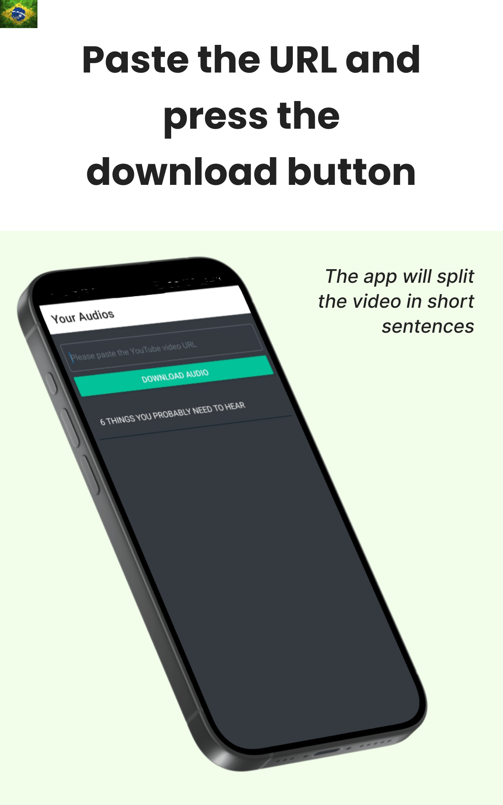
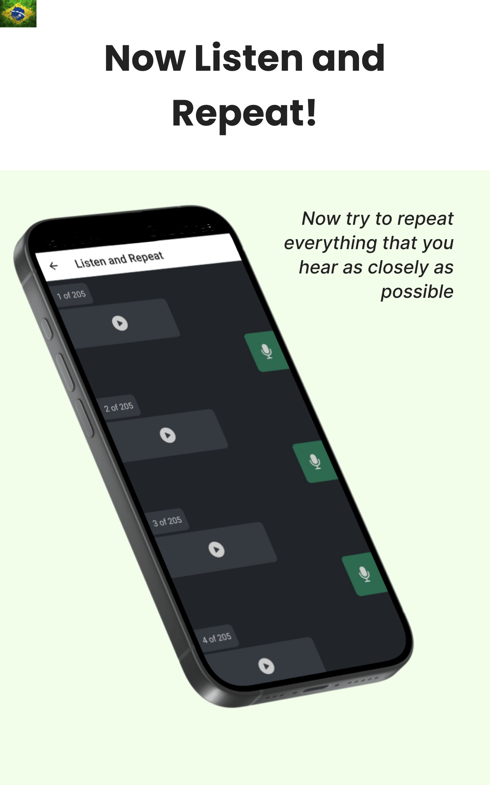

## To run the back-end
First you need to install FFmpeg on your machine: [FFmpeg](https://www.ffmpeg.org/download.html) <br>

Change the HOST var in "main.py" file: <br>
```HOST = <your network IP goes here>```

Install the dependecies: <br>
```pip install -r requirements.txt```

Now you can run: <br>
```python main.py```

When you're using the App make sure that you are connected to the same internet connection as the server.

React Native repo: [Shadowing-App-react-native](https://github.com/GabriellBarbosa/Shadowing-App-react-native)